# Lab 11 – IAM Identity Lifecycle & Access Control

## Objective

Build and test an identity and access management (IAM) workflow in Active Directory using group-based access control.

In this lab, I simulated the identity lifecycle of a test user through the Joiner, Mover, and Leaver stages. Access to Finance and HR resources was controlled through Active Directory security groups rather than assigning permissions directly to the user. I then reviewed Windows Security events in Splunk to investigate the account and group membership changes.

## Lab Environment

- Windows Server Domain Controller – DC01
- Active Directory Domain Services
- Domain: lab.local
- Domain-joined Windows client
- Active Directory Users and Computers (ADUC)
- Windows File Shares
- Windows Security Auditing
- Splunk Enterprise

## Access Control Design

I used an AGDLP-style group structure to manage access.

### Finance

Jordan Rivera → GG_Finance_Users → DL_Finance_RW → Finance Share

### Human Resources

Jordan Rivera → GG_HR_Users → DL_HR_RW → HR Share

The global groups contain users while the domain local groups are assigned permissions to the resources.

### Group Nesting

The Finance global group was added as a member of the Finance domain local group.

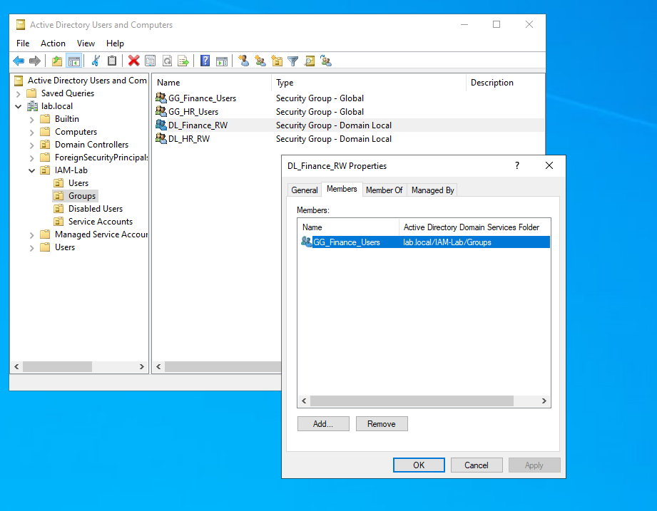

The same group structure was configured for HR.

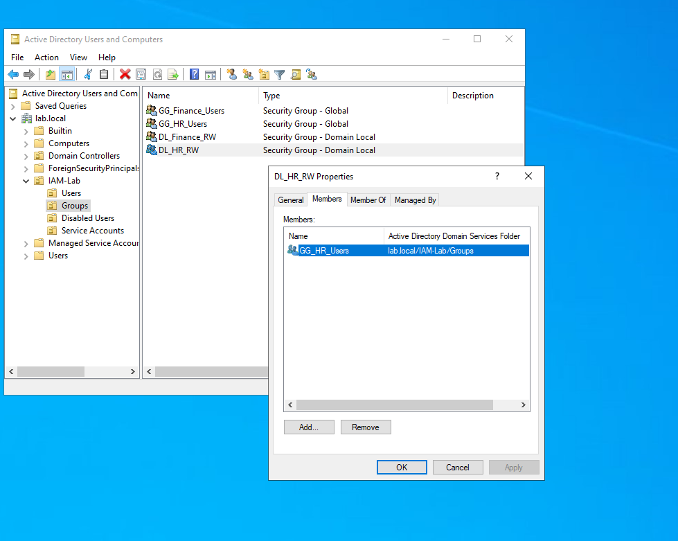

## Joiner – Initial Finance Access

I created a test user named Jordan Rivera and assigned the account to the `GG_Finance_Users` group.

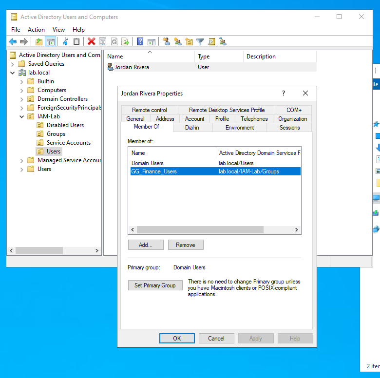

The Finance share was configured so that access was provided through `DL_Finance_RW`.

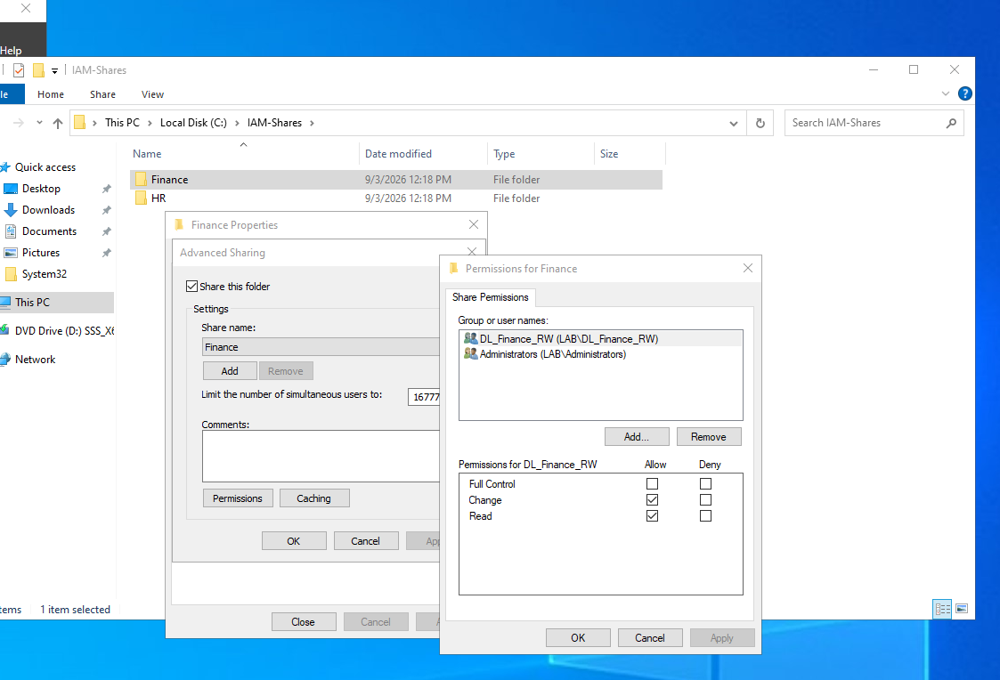

I logged into the domain-joined client as Jordan and created a test file inside the Finance share to confirm that the account had write access.

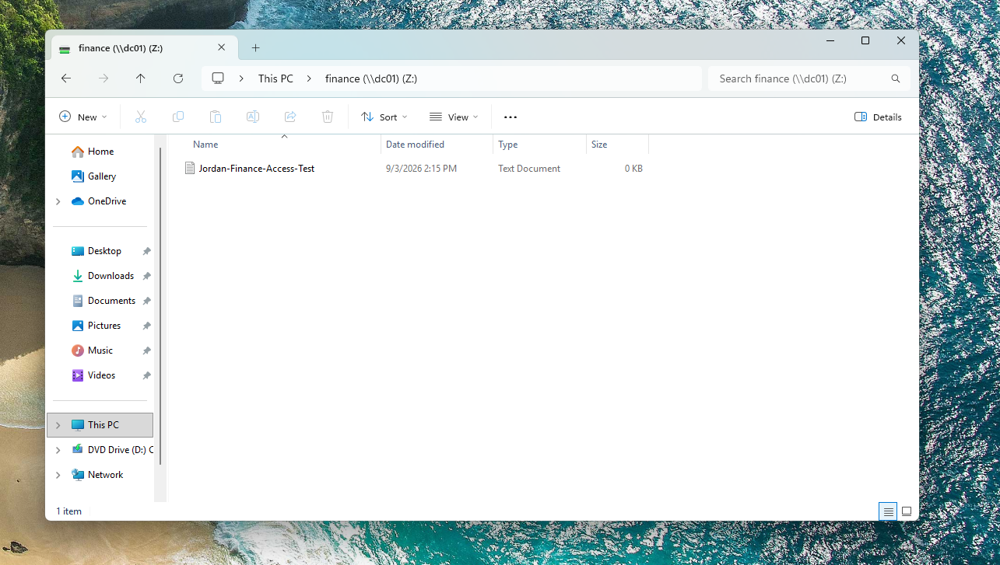

## Testing Unauthorized HR Access

The HR share was configured using the same group-based access model.

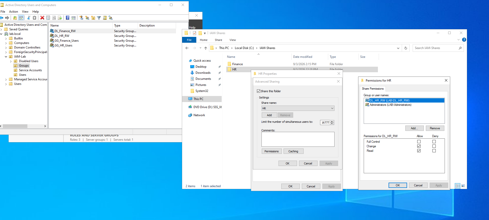

Before Jordan was assigned to the HR group, I attempted to access the HR share from the client. Access was denied because the account did not yet have the required group membership.

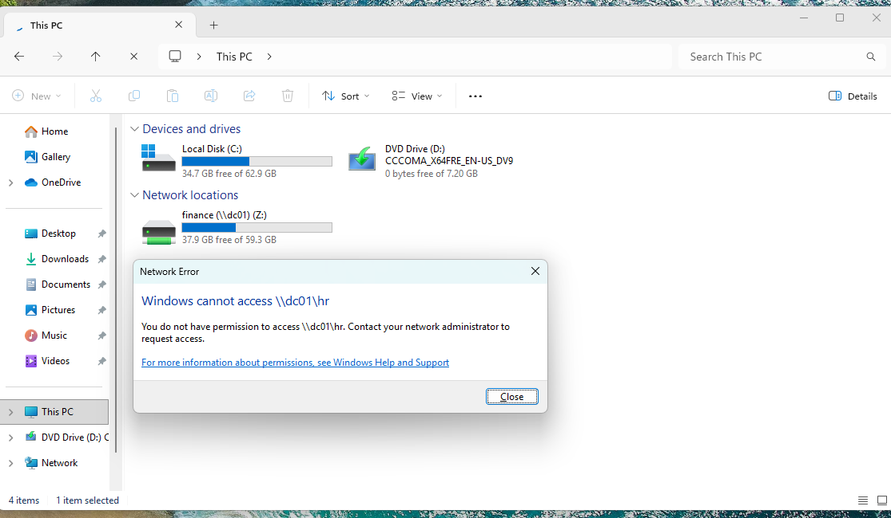

## Mover – Finance to HR

To simulate a user changing departments, I removed Jordan from the Finance users group and added the account to the HR users group.

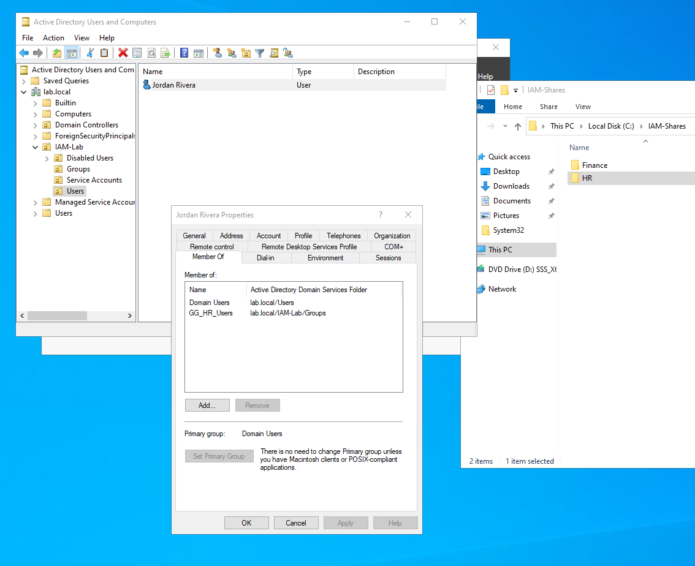

I tested access again from the client. Jordan was able to access the HR resource while the previous Finance access was no longer available.

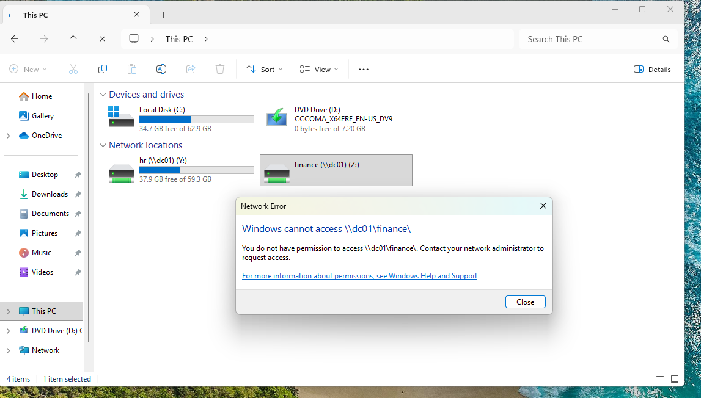

This demonstrated how access can be changed by modifying group membership instead of assigning permissions directly to individual users.

## Leaver – Account Deprovisioning

To simulate the user leaving the organization, I removed the account's access group membership, disabled the account, and moved it into the Disabled Users organizational unit.

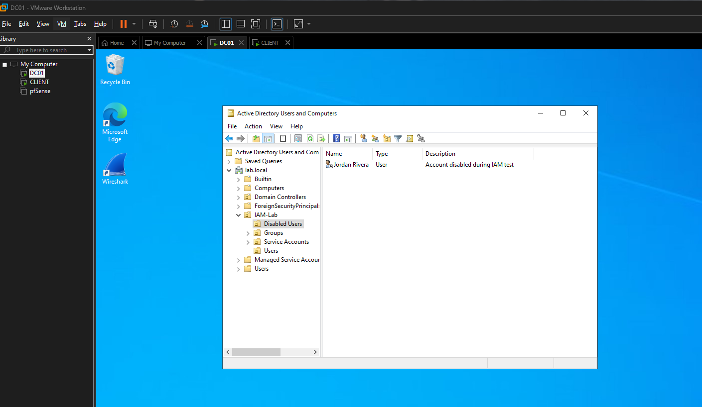

I then attempted to sign in as Jordan from the client. Windows prevented the login because the account had been disabled.

## Monitoring and Investigation

After completing the identity lifecycle changes, I used Splunk to review Windows Security events associated with Jordan's account.

This allowed me to correlate account creation, group membership changes, account modification, and account disabling activity.

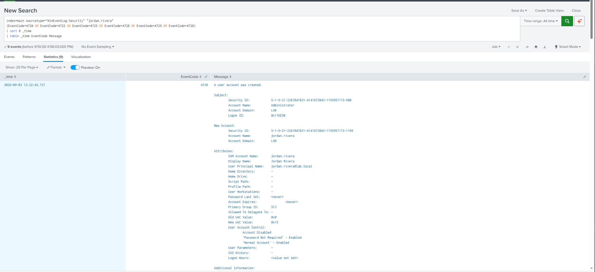

### Event ID 4720 – User Account Created

Event ID 4720 recorded the creation of the Jordan Rivera account.

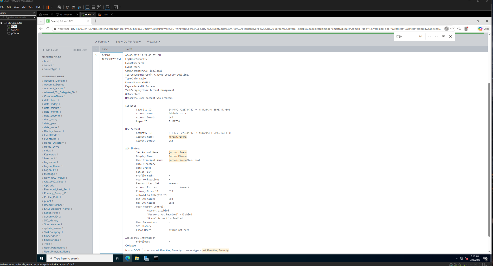

### Event ID 4732 – Group Membership Added

Event ID 4732 provided visibility into membership being added to a security-enabled local group. In this lab, this was used as evidence of the group nesting used for the access control structure.

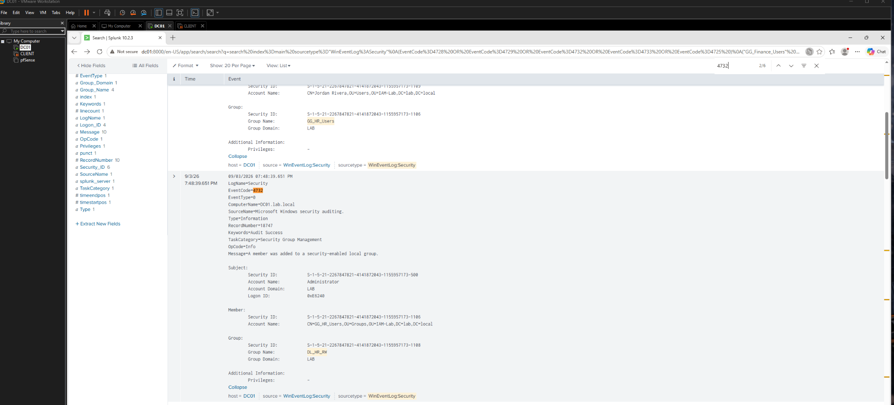

### Event ID 4729 – Group Membership Removed

Event ID 4729 recorded membership being removed from a security-enabled global group during the identity lifecycle changes.

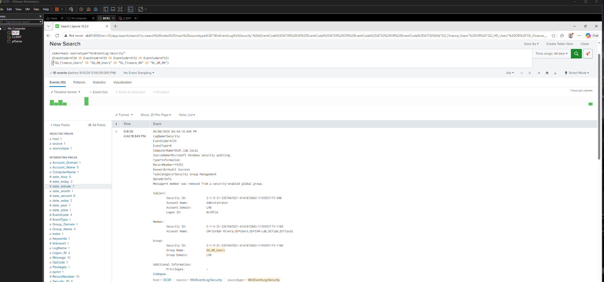

Additional group membership removal activity was also reviewed during access removal.

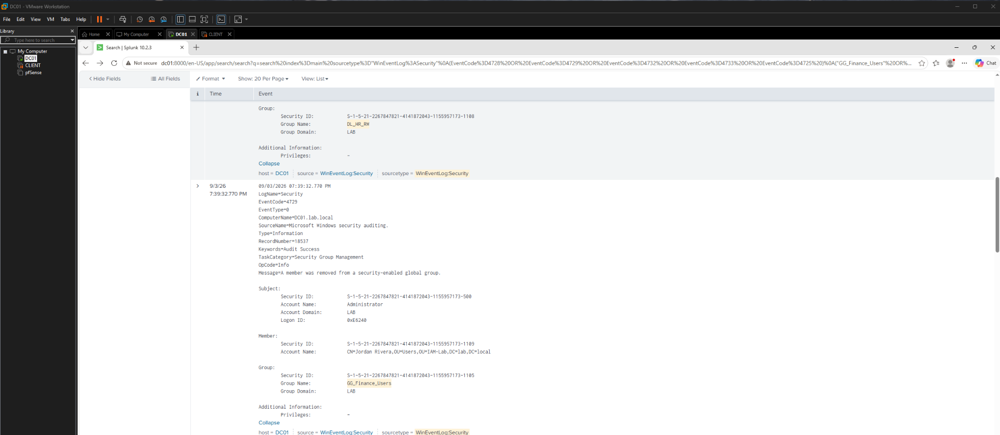

### Event ID 4725 – User Account Disabled

Event ID 4725 recorded the disabling of Jordan's account during the Leaver stage.

I reviewed the event in Splunk:

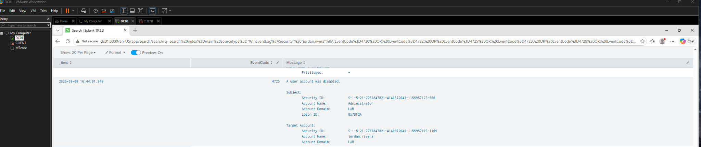

I also reviewed the original Windows Security event in Event Viewer.

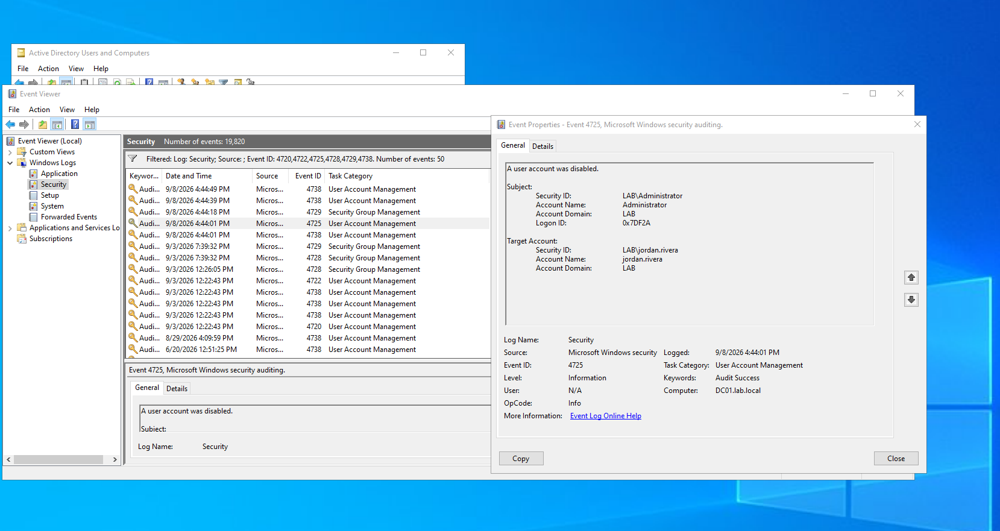

This allowed me to compare the source Windows event with the event being investigated through Splunk.

### Event ID 4738 – User Account Changed

Event ID 4738 provided additional visibility into changes made to the user account.

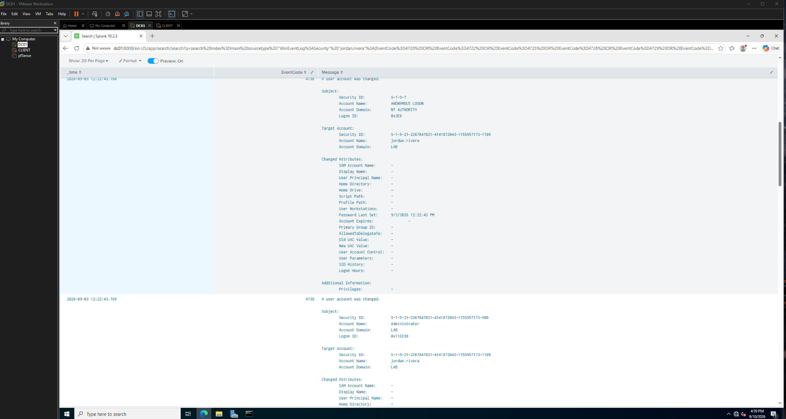

## What I Learned

This lab helped me understand how identity and access management works beyond simply creating Active Directory users.

I practiced using security groups to control access to resources, nesting groups to separate users from resource permissions, and modifying group membership as a user's role changes.

The Joiner, Mover, and Leaver workflow also showed how access should follow the lifecycle of an account. When a user changes roles, their access should change with them, and when the account is no longer needed, its access should be removed and the account disabled.

Finally, reviewing the related Windows Security events in Splunk showed how identity changes can be monitored and investigated from a security perspective.
