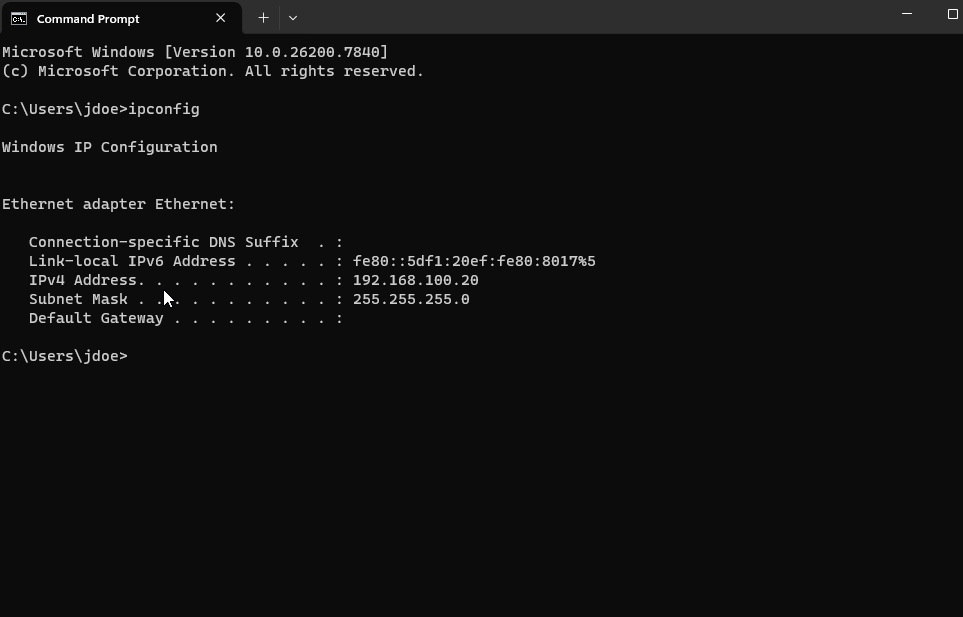
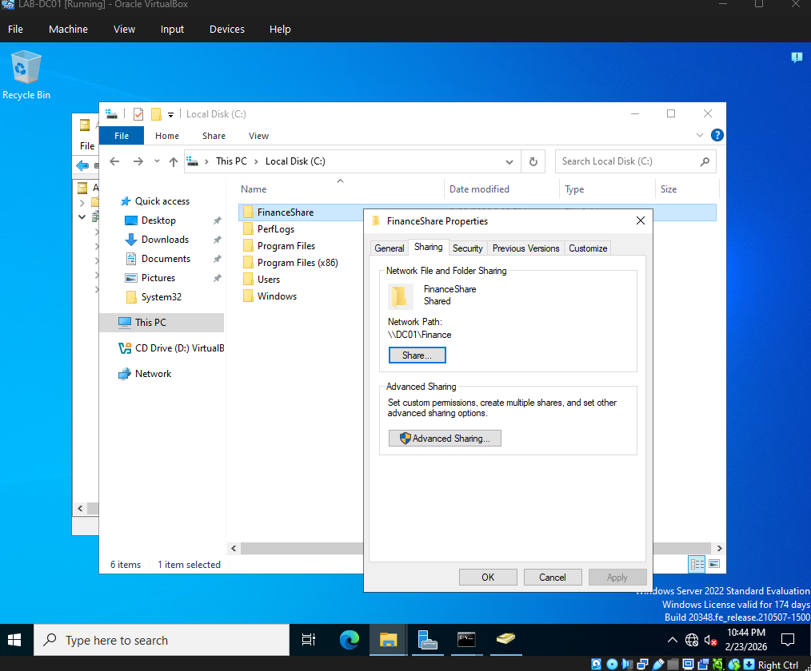
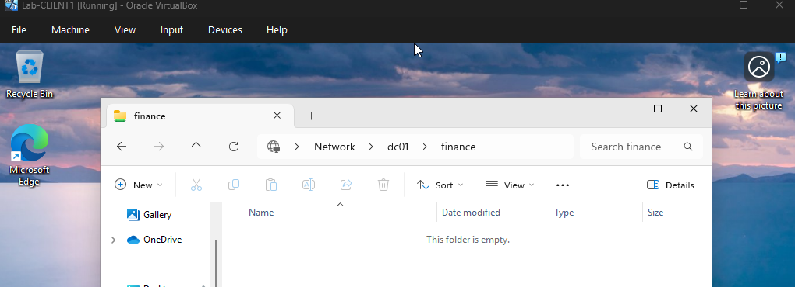

# Lab 1 – Active Directory Setup and User Management

## 📌 Objective

In this lab, I built a basic Active Directory environment using Windows Server and configured domain users, groups, and permissions. The goal was to understand identity management and how user access is controlled in a Windows domain environment.

## 🧠 Lab Overview

In this lab environment:

- A Windows Server machine (`DC01`) was configured as a Domain Controller
- Active Directory Domain Services (AD DS) was installed
- A domain (`lab.local`) was created
- A Windows client machine was joined to the domain
- Users and security groups were created and managed within Active Directory

## ⚙️ What I Implemented

- Installed and configured Active Directory Domain Services (AD DS)
- Promoted Windows Server to a Domain Controller (`DC01`)
- Created the `lab.local` domain
- Created Organizational Units (OUs) for user organization
- Created domain users such as `jdoe`
- Created security groups for access management
- Assigned users to appropriate security groups
- Configured permissions using group membership
- Joined a Windows client machine to the domain
- Logged into the client using domain user accounts
- Tested access to shared resources based on assigned permissions

## 🔐 Identity & Access Concepts

### 👤 User Accounts

Each user is uniquely identified within the Active Directory domain.

Example:

`LAB\jdoe`

Domain accounts allow authentication and access to centrally managed resources.

### 👥 Security Groups

Security groups were used to manage access efficiently.

Rather than assigning permissions individually to every user, users can be placed into groups and permissions can be assigned to those groups.

This provides a more scalable method of access management.

### 🗂️ Organizational Units (OUs)

Organizational Units were used to logically organize Active Directory objects such as users and groups.

OUs make Active Directory easier to manage and provide a structure that can later be used for applying Group Policy Objects (GPOs).

## 🧪 Testing & Validation

To validate the Active Directory configuration, I:

- Logged into the Windows client using domain user credentials
- Verified successful authentication against the Domain Controller
- Confirmed security group membership
- Tested access to shared resources based on assigned permissions

## 📸 Screenshots

### Active Directory User and Group Membership

The domain user `jdoe` was added to the Finance security group, demonstrating group-based user management in Active Directory.

### Client Network Configuration

The Windows client was configured on the lab network for communication with the Domain Controller.

### Domain Controller Network Configuration

DC01 was configured with a static IP address to provide consistent Active Directory and DNS services within the lab environment.

### Finance Network Share Configuration

A Finance folder was configured as a network share on DC01 and made available through the UNC path `\\DC01\Finance`.

### Finance Share Access Validation

The domain client successfully accessed the Finance network share hosted on DC01, validating connectivity and access to the shared resource.

## 🧠 Key Takeaways

- Active Directory provides centralized identity management in Windows enterprise environments
- Users and security groups are fundamental components of access control
- Group-based permissions are more scalable than assigning permissions individually
- Domain Controllers provide centralized authentication and authorization
- Domain-joined systems rely on Active Directory for domain authentication
- Organizational Units provide a structured way to organize and manage directory objects
