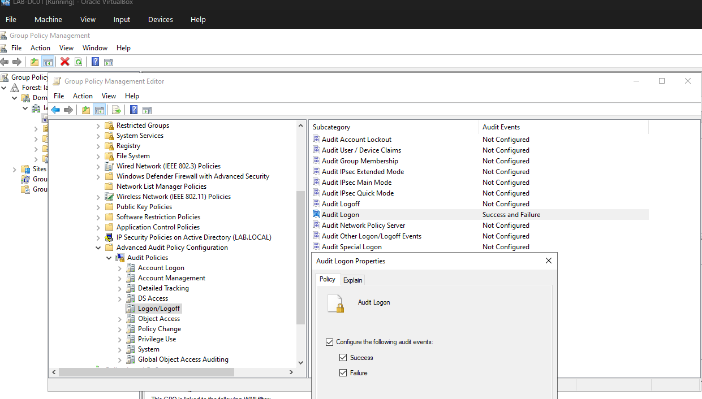
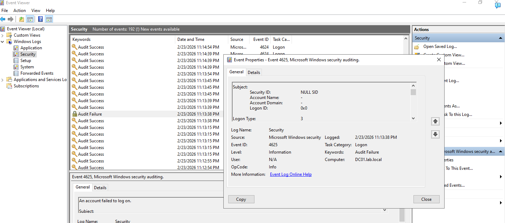

#  Lab 2 – Failed Logon Detection with Windows Event Viewer

##  Objective

The objective of this lab was to configure Windows security auditing in an Active Directory environment and investigate failed authentication attempts using Windows Security Event Logs.

This lab demonstrates how failed logon activity can be identified through Event ID 4625, which is commonly reviewed during authentication-related security investigations.

##  Lab Overview

The lab environment consisted of:

- Windows Server Domain Controller (DC01)
- Active Directory domain (`lab.local`)
- Domain-joined Windows client
- Group Policy Management
- Windows Event Viewer

Security auditing was configured through Group Policy to record successful and failed logon activity.

##  What I Implemented

- Opened Group Policy Management on the Domain Controller
- Configured Advanced Audit Policy settings
- Enabled auditing for successful and failed logon attempts
- Generated failed authentication activity
- Reviewed Windows Security logs on DC01
- Identified Event ID 4625 associated with a failed logon attempt

##  Audit Policy Configuration

The following audit policy was enabled:

**Advanced Audit Policy Configuration → Audit Policies → Logon/Logoff → Audit Logon**

Configured to audit:

- Success
- Failure

##  Event ID 4625 – Failed Logon

Windows Security Event ID **4625** is generated when an account fails to log on.

- Account information
- Logon type
- Source information
- Timestamp
- Failure details

##  Testing & Validation

Failed authentication activity was generated in the lab environment.

Windows Event Viewer was then used on DC01 to review the Security log and confirm that the failed authentication generated **Event ID 4625 – An account failed to log on**.

##  Screenshots

### Audit Policy Configuration

Advanced Audit Policy was configured to record both successful and failed logon events.

### Failed Logon – Event ID 4625

Windows Event Viewer recorded Event ID 4625 following a failed authentication attempt.

##  Key Takeaways

- Windows auditing can provide visibility into authentication activity.
- Event ID 4625 identifies failed Windows logon attempts.
- Group Policy can centrally configure auditing within an Active Directory environment.
- Windows Security logs provide information that can be used during authentication investigations.
- Repeated failed authentication events can be investigated for potentially suspicious activity.
